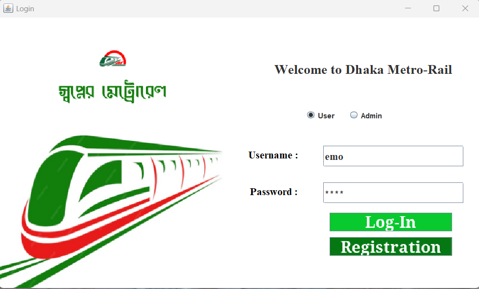
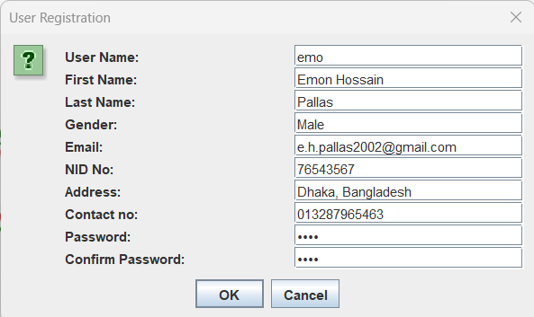
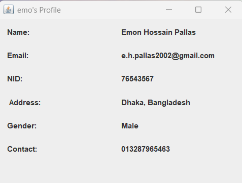
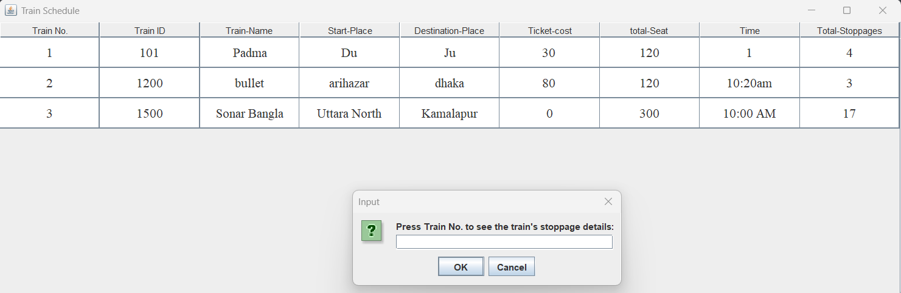
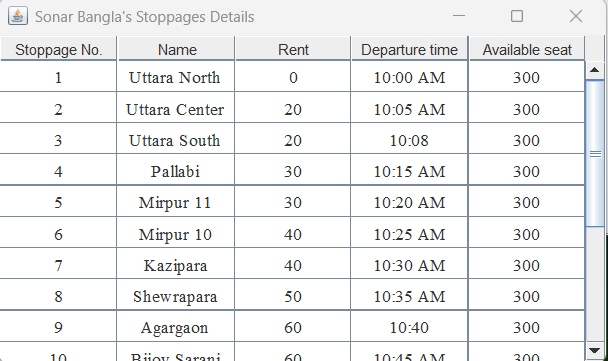
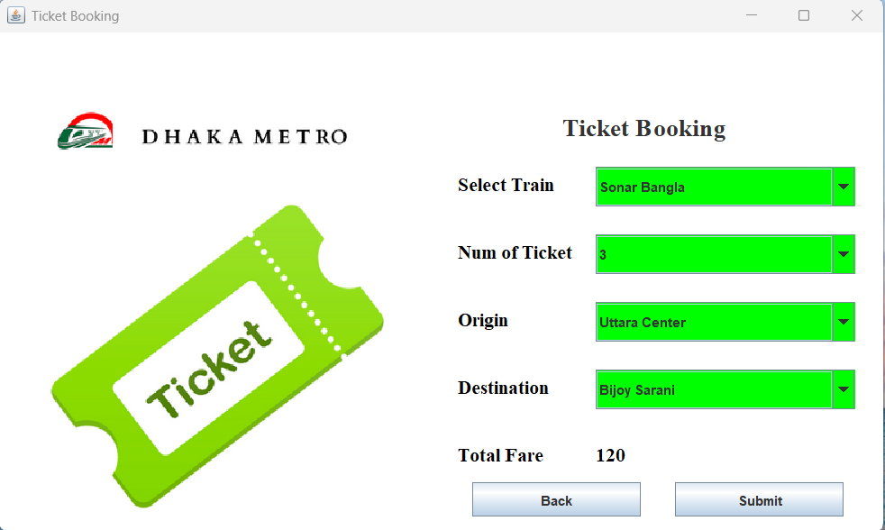
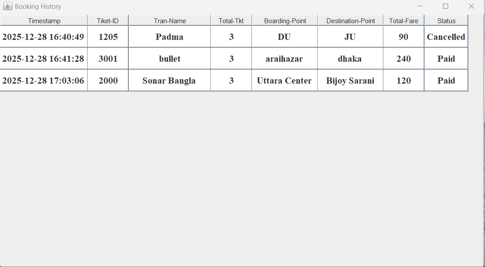
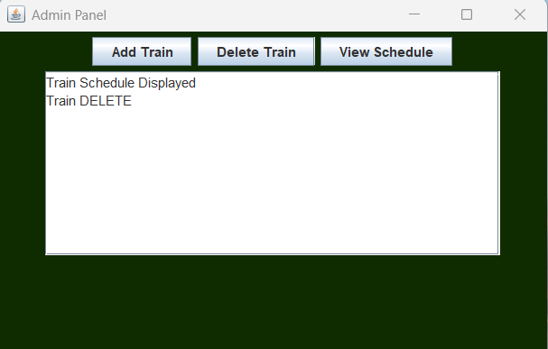
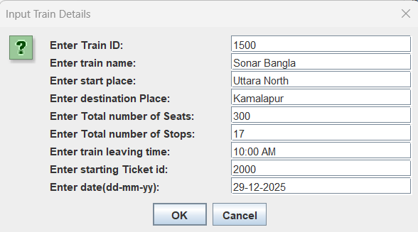

# 🚇 Dhaka Metro-Rail Management System

A high-performance, GUI-driven desktop application developed in **Java** to automate metro rail operations. This project leverages **Object-Oriented Programming (OOP)** and persistent file storage to provide a seamless experience for both passengers and administrators.

---

## 🛠 Tech Stack

* **Language:** Java (JDK 8+)
* **GUI Framework:** Java Swing & AWT (Abstract Window Toolkit)
* **Data Persistence:** Java File I/O (Serialized Object Storage via `.ser` files)
* **Design Pattern:** Modular OOP architecture utilizing Inheritance and Encapsulation

---

## 🌟 Key Features

### 👤 Passenger (User) Module
* **Interactive Booking:** Select trains, origins, and destinations with automated fare calculation.
* **Seat Management:** Real-time tracking of seat availability across different journey segments.
* **Live Schedule:** View comprehensive train timings and detailed stoppage information.
* **Travel History:** A robust log of all transactions with "Paid" or "Cancelled" status tracking.
* **Profile Management:** Access and view personal user information including NID and contact details.

### 🔑 Administrative Module
* **Fleet Control:** Add new trains with customized routes, ticket IDs, and seating capacities.
* **Schedule Maintenance:** Delete obsolete train records and update active routes via Train ID.
* **System Logs:** Monitor operations via a dedicated Admin Panel console.

---

## 📊 System Architecture
The project is built on a modular OOP structure, ensuring high maintainability and data encapsulation.


---

## 📸 Screenshots & Walkthrough

### 1. Authentication & Onboarding
The application features a secure login portal for both Users and Admins. New passengers can easily register through an interactive form.

| Welcome & Login | User Registration |
| :---: | :---: |
|  |  |

### 2. User Dashboard & Profile
Upon login, users are greeted with a personalized dashboard and can access their verified profile details.

| User Dashboard | Personal Profile |
| :---: | :---: |
|  |  |

### 3. Scheduling & Stoppage Details
Passengers can view the full metro schedule. Selecting a train reveals specific stoppage names, departure times, and rent between stations.

| Train Schedule | Stoppage Details |
| :---: | :---: |
|  |  |

### 4. Booking & History
The system supports a multi-step booking process including segment-based fare estimation and payment method confirmation.

| Ticket Booking | Travel History |
| :---: | :---: |
|  |  |

### 5. Admin Control Panel
Admins manage the system through a powerful interface to add new trains or remove existing ones from the network.

| Admin Dashboard | Adding a Train |
| :---: | :---: |
|  |  |

---

## ⚙️ Setup & Installation

1.  **Clone the Repository:**
    ```bash
    git clone [https://github.com/e-h-p/DHAKA-METRORAIL.git](https://github.com/e-h-p/DHAKA-METRORAIL.git)
    ```
2.  **Compile & Run:** Run `TrainSystemGUI.java` to start the application.
    * *Note:* Ensure the `.ser` files are in the root directory for persistent data loading.

---

## 👨‍💻 Author
**Emon Hossain Pallas**
* **GitHub:** [e-h-p](https://github.com/e-h-p)

---
*⭐ If you find this project useful, please consider giving it a star!*